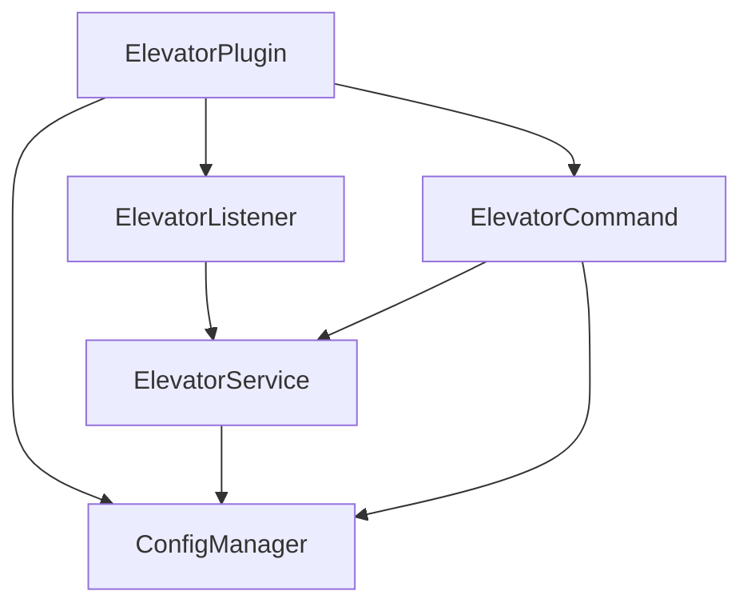

# IronElevators 再実装 設計書

## 背景・目的

既存の非OSSプラグイン「IronElevators」(SpigotMC resource #19451) が Minecraft 1.21.11 環境（Paper）で動作しない（プラグインのロード自体が失敗する）。元リポジトリ（[warasugitewara/elevator](https://github.com/warasugitewara/elevator)）は空であり、参照可能なソースコードは存在しない。よって、元プラグインの公開されている動作仕様（特定ブロックを縦に積んでシャフトを作り、ジャンプ/スニークで上下移動するエレベーター）を踏襲しつつ、Paper API 1.21.11 向けに完全新規実装する。

加えて、元プラグインにはなかった「コマンドによる設定の即時編集」機能を追加する。

## 対象環境

- Minecraft / Paper API: 1.21.11
- Java: 21
- ビルド: Gradle
- 外部プラグイン依存: なし（WorldGuard等への依存はしない）

## 機能要件

### 基本動作

1. 設定で登録されたブロック種類（デフォルト: 鉄ブロック・ダイヤモンドブロック・ネザライトブロック）が縦に並んだ「シャフト」の上に立つ。
2. **ジャンプ**すると上方向、**スニーク**すると下方向に、次の有効なエレベーター階までテレポートする。
3. 階の探索ロジック:
   - 現在地から連続する同一エレベーターブロック区間を通過する。
   - 区間が途切れたら、そのブロック種類に設定された `max-gap`（最大ガップ距離）以内で次のエレベーターブロックを探索する。
   - 見つかった階の着地スペース（足元1＋頭上1分の通行可能な空間）を検証する。
   - **スペースが塞がっている場合はその階を候補から除外し、同方向にさらに先の階を探索する**（移動可能距離は同ブロック種別の `max-gap` の範囲内で再帰的に評価する）。
   - 安全な階が見つかればテレポートしサウンドを再生する。見つからなければ何もしない。
4. 連続トリガーを避けるため、テレポート直後は短いクールダウン（数百ms）を設ける。

### ブロック種類ごとの設定

ブロック種類ごとに個別の `max-gap` を持つ（全体共通設定は廃止）。デフォルト値:

| ブロック | max-gap |
|---|---|
| `minecraft:iron_block` | 15 |
| `minecraft:diamond_block` | 30 |
| `minecraft:netherite_block` | 90 |

### コマンド（管理機能・元プラグインにはない新機能）

元プラグインは `config.yml` を直接編集して `reload` する必要があったが、本実装はコマンドで即時に設定を変更・保存できるようにする（手動でのファイル編集・再起動は不要）。

| コマンド | 説明 | 権限 |
|---|---|---|
| `/elevator block add <material> <max-gap>` | エレベーター対象ブロックを追加・更新 | `elevator.admin` |
| `/elevator block remove <material>` | 対象ブロックを削除 | `elevator.admin` |
| `/elevator block list` | 対象ブロックと各 max-gap の一覧表示 | `elevator.admin` |
| `/elevator sound <on\|off>` | テレポート時サウンドの有効/無効切替 | `elevator.admin` |
| `/elevator info` | 現在の全設定値を表示 | `elevator.admin` |
| `/elevator reload` | ディスクの config.yml から再読込（手動編集時用） | `elevator.admin` |

エイリアス: `/el`。コマンドによる変更は即座に `config.yml` へ保存される。

### 権限

- `elevator.use` — エレベーターのテレポート機能自体を使う権限。デフォルト: 全員許可 (`true`)
- `elevator.admin` — 上記コマンド群を使う権限。デフォルト: OPのみ

## アーキテクチャ



- **ElevatorPlugin**: `JavaPlugin` を継承するメインクラス。起動時に各コンポーネントを初期化し、コマンド・リスナーを登録する。
- **ConfigManager**: `config.yml` の読み込み・書き込みを担当。ブロック設定（material → max-gap のマップ）とサウンド設定を保持し、変更を即座にディスクへ反映する。
- **ElevatorService**: Bukkit イベントに依存しない純粋なロジック層。
  - `isElevatorBlock(Material): boolean`
  - `findNextFloor(World world, Location current, Direction direction): Optional<Location>` — 連続区間の通過、ガップ探索、着地スペースの安全性検証、複数階の再帰的スキップを行う。
- **ElevatorListener**: `PlayerMoveEvent` でプレイヤーの足元ブロックとクールダウンを監視し、`PlayerToggleSneakEvent` でスニーク開始を検知。ジャンプ判定は移動イベント内で `player.getVelocity().getY() > 0` かつ直前まで地上にいたことを条件とする。トリガー成立時に `ElevatorService` を呼び出し、結果が得られればテレポート＋サウンド再生。
- **ElevatorCommand**: `/elevator` のサブコマンドをディスパッチし、`ConfigManager` を介して設定を変更・表示する。

## 設定ファイル（config.yml）

```yaml
blocks:
  - material: minecraft:iron_block
    max-gap: 15
  - material: minecraft:diamond_block
    max-gap: 30
  - material: minecraft:netherite_block
    max-gap: 90
sound:
  enabled: true
  ascend: minecraft:block.beacon.activate
  descend: minecraft:block.beacon.deactivate
```

## エラーハンドリング・エッジケース

- 着地スペースが塞がっている階はスキップし、同ブロック種別の `max-gap` の範囲内でさらに先を探索する。範囲内に安全な階がなければ何もしない（テレポートしない）。
- 存在しない/不正な `Material` 名がコマンドで指定された場合はエラーメッセージを返し、設定は変更しない。
- ワールド間移動は行わない（同一ワールド内の縦方向探索のみ）。
- クリエイティブ/スペクテイターモードでも動作対象とする（除外条件は設けない）。

## テスト方針

- `ElevatorService` は Bukkit API への依存を最小化し、ブロック種類とその配置（テスト用の仮想カラム表現）を入力として「次の安全な階」を返す純粋ロジックとして実装し、JUnitで単体テストする。
- 実機（Paperサーバー）でのジャンプ/スニーク・ガップ越え・塞がった階のスキップ・コマンドによる設定変更の動作確認を手動テストで実施する。

## スコープ外

- WorldGuardなどの外部プラグイン連携
- カゴの視覚表現（Display Entity等）
- マルチワールドをまたぐ移動
